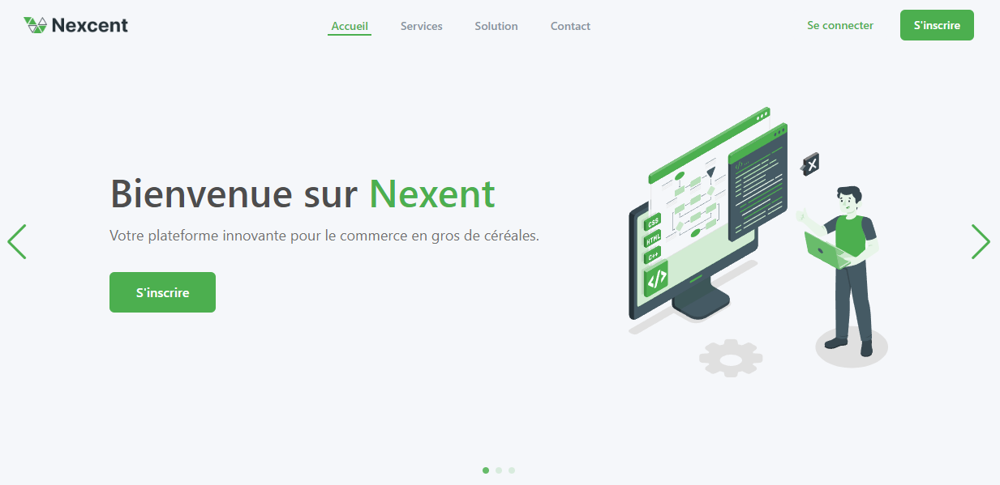

<div align="center">
    
    <h1>React Landing Page</h1>
</div>

This project is a simple landing page template. It is a responsive and mobile-friendly template that can be used for various purposes. The template is built using React and Tailwind CSS.

---

<div align="center">
    
</div>


## 🚀 Usage

1. Clone the repository using the following command:

```bash
git clone git@github.com:zestones/react-landing-page-template.git
```

2. Navigate to the project directory:

```bash
cd react-landing-page-template
cd landing-page
```

3. Install the dependencies:

```bash
npm install
```

4. Start the development server:

```bash
npm run dev
# or
yarn dev
# or
pnpm dev
```

5. Open the browser and navigate to `http://localhost:5173/react-landing-page-template/` to view the landing page.


## 🎨 Design

If you need the design files, you can download them from Figma's Community page : [Figma Design File](https://www.figma.com/community/file/1222060007934600841/responsive-landing-page-design-website-home-page-design-agency-website-ui-design)

